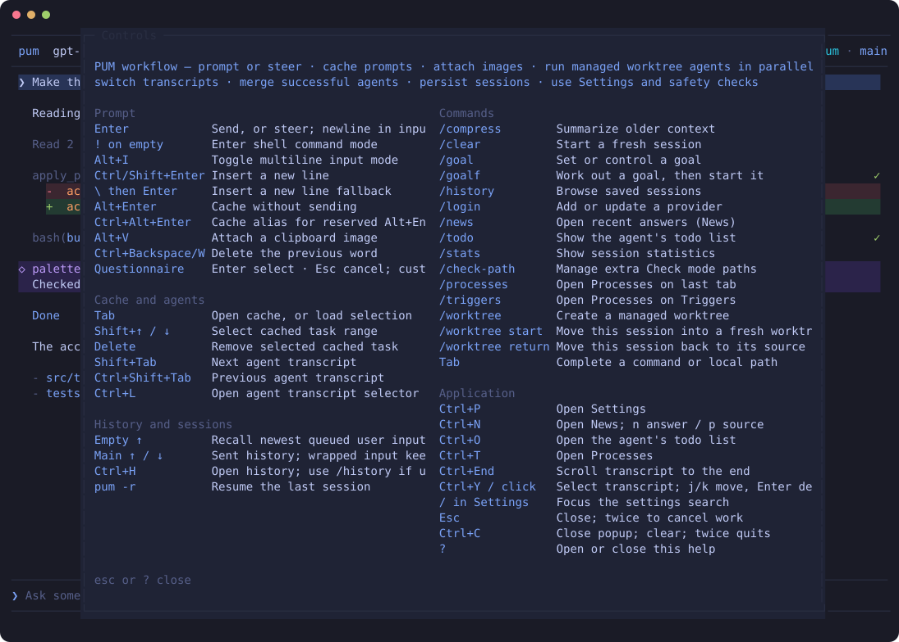

<div align="center">

# PUM

**A compact coding agent for the terminal.**

Plan, edit, run commands, review Markdown, and coordinate parallel subagents without leaving the TUI.

[](https://github.com/eugen1763/Pum/actions/workflows/ci.yml)
[](https://www.npmjs.com/package/pum-agent)
[](LICENSE)
[](https://bun.sh)

</div>

## Quick start

```bash
bun i -g pum-agent@beta
pum
```

PUM opens the login panel automatically on the first start. Press `?` on an
empty prompt to see every control.

> [!WARNING]
> PUM can read, write, and delete files. Check mode adds deterministic policy
> checks, and supported hosts can enforce native Bash isolation, but the
> file-tool sandbox is a process-local path guard, not operating-system
> isolation. Read [Safety](docs/security.md) before using untrusted workspaces.


<details>
<summary><strong>Settings panel</strong></summary>


</details>

<details>
<summary><strong>Controls panel</strong></summary>



</details>

These are real OpenTUI renders, not mockups. `bun run scripts/capture-screenshots.tsx`
drives the actual TUI and converts the captured cells to SVG.

## What it does

- **A full coding loop** — `read`, `write`, `edit`, and `bash`, with streaming Markdown, syntax highlighting, usage, cost, and Git status.
- **Parallel subagents** — persistent agents that share the project by default, with optional isolated Git worktrees. They message each other durably and report to their spawner. See [Subagents](docs/subagents.md).
- **Goals that outlive a turn** — `/goal` keeps working, reviewed after each turn by a judge that reads but never writes. See [Goals](docs/goals.md).
- **Supervised processes** — background shells and external triggers such as `gh run watch`, which wake the exact agent that was waiting. See [Tools](docs/tools.md).
- **Layered safeguards** — a path guard on the file tools, deterministic Check mode, and a native OS sandbox for the processes the model starts. See [Safety](docs/security.md).
- **A terminal-first look** — nine themes, semantic colour overrides, and optional animation. See [Appearance](docs/appearance.md).

PUM uses [pi](https://github.com/earendil-works/pi) for the agent loop and
[OpenTUI](https://github.com/anomalyco/opentui) for rendering.

## Documentation

| Guide | Contents |
|---|---|
| [Command line](docs/cli.md) | Options, headless runs, sandboxed launches, environment |
| [Controls](docs/controls.md) | Keys, slash commands, shell command mode, copying, News |
| [Goals](docs/goals.md) | `/goal`, the judge, retries, stopping |
| [Subagents](docs/subagents.md) | Spawning, merging, previews, readonly children |
| [Tools](docs/tools.md) | Tool groups, patches, questionnaires, triggers, shells, todos |
| [Safety](docs/security.md) | Filesystem sandbox, Check mode, native sandbox, outer sandbox |
| [Appearance](docs/appearance.md) | Transcript detail, themes, Markdown, animation, title |
| [Configuration](docs/configuration.md) | Where PUM stores things, and what |

## Requirements

- [Bun](https://bun.sh) — PUM runs on Bun, not Node
- Git
- An interactive terminal with ANSI/VT and Unicode support
- Credentials for a supported provider, or an OpenAI-compatible endpoint

Linux and macOS are the primary environments. Windows CI checks the code and
Windows path behaviour, but native Windows TUI operation is provisional.

Native Bash sandboxing is optional and platform-specific: on Linux it needs
Bubblewrap (`bwrap`) with working unprivileged user namespaces, which PUM probes
by launching a minimal sandbox rather than by finding the executable; on Windows
it uses the alpha `@microsoft/mxc-sdk` and its `base-container` tier. On Windows,
also install Git for Windows, keep `bash.exe` on `PATH`, and use Windows
Terminal with PowerShell — not PowerShell ISE.

## Install from source

```bash
git clone https://github.com/eugen1763/Pum.git
cd Pum
bun install --frozen-lockfile
bun run login
bun run start
```

Use `bun run start -r` to resume the latest session for the current directory,
and `/login` to add or update a provider later.

The published package is called `pum-agent` because the bare `pum` name is
taken; the installed command is still `pum`. `npm i -g pum-agent` copies the
files, but `pum` then fails with `env: 'bun': No such file or directory` —
install Bun first.

## Development

```bash
bun install --frozen-lockfile
bun test
bun run typecheck
git diff --check
```

Run the TUI from the repository root with `bun run start`, and refresh the
README images with `bun run scripts/capture-screenshots.tsx`. Use a throwaway
`PUM_DIR` for local integration tests, and capture TUI output through `tmux`
rather than piping standard output. [AGENTS.md](AGENTS.md) holds the
architecture, the locked decisions, and the TUI test guidance.

## Release status

PUM `0.2` is in beta. Interfaces and persisted formats can still change before
the stable release. Review the release notes before upgrading sessions or custom
configuration.

## License

PUM is available under the [MIT License](LICENSE).
