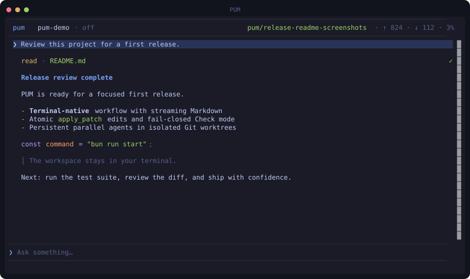
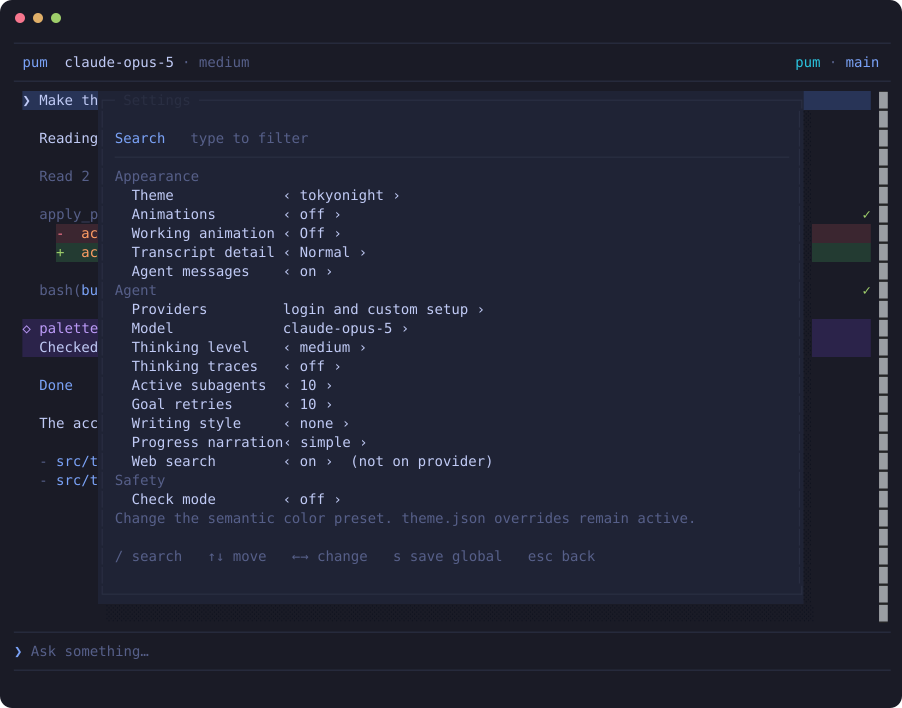

<div align="center">

# PUM

**A compact coding agent for the terminal.**

Plan, edit, run commands, review Markdown, and coordinate parallel Git worktrees without leaving the TUI.

[](https://github.com/eugen1763/Pum/actions/workflows/ci.yml)
[](https://www.npmjs.com/package/pum-agent)
[](LICENSE)
[](https://bun.sh)

</div>

> [!WARNING]
> PUM can read, write, and delete files. PUM can also run shell commands without approval. Start PUM only inside a workspace where these actions are acceptable. Check mode adds a verifier, but it is not a sandbox.

## See PUM in action

The following screens are real OpenTUI renders captured through `tmux`. A local mock provider supplied the model output.



<details>
<summary><strong>Settings panel</strong></summary>



</details>

## Why PUM

- **Compact terminal UI:** Streaming Markdown, syntax highlighting, thinking traces, tool rows, usage, cost, and Git status.
- **Full coding loop:** Built-in `read`, `write`, `edit`, `bash`, and atomic `apply_patch` tools.
- **Parallel subagents:** Persistent agents work in isolated Git worktrees and report to the main agent.
- **Prompt control:** Steer active work, stash prompt batches, attach clipboard images, cancel turns, and resume sessions.
- **Provider choice:** Use the login methods exposed by pi, or add an OpenAI-compatible custom endpoint.
- **Optional safeguards:** Enable fail-closed Check mode for `bash`, `edit`, and `apply_patch` calls.
- **Terminal-first appearance:** Nine themes, semantic color overrides, Unicode glyphs, and optional animation.

PUM uses [pi](https://github.com/earendil-works/pi) for the agent loop and [OpenTUI](https://github.com/anomalyco/opentui) for rendering.

## Requirements

- [Bun](https://bun.sh)
- Git
- An interactive terminal with ANSI/VT and Unicode support
- Credentials for a supported provider, or an OpenAI-compatible endpoint

Linux and macOS are the primary environments. Windows CI checks the code and Windows path behavior. Native Windows TUI operation remains provisional because it has not been fully validated in a Windows terminal.

On Windows, install Git for Windows. Ensure that `bash.exe` is in `PATH` or remains in its standard location. Use Windows Terminal with PowerShell. Do not use PowerShell ISE.

## Install and start

### Install from source

```bash
git clone https://github.com/eugen1763/Pum.git
cd Pum
bun install --frozen-lockfile
bun run login
bun run start
```

PUM opens the login panel automatically when no provider is available. Use `/login` later to add or update a provider.

Resume the latest session for the current directory:

```bash
bun run start -r
```

### Install the beta package

```bash
bun i -g pum-agent@beta
pum
```

The package is named `pum-agent` because the bare `pum` name is already owned. The installed command is still `pum`.

## Essential controls

| Key | Action |
|---|---|
| `Enter` | Send a prompt, or steer the selected working agent |
| `Ctrl+Enter` / `Shift+Enter` | Insert a new line |
| `Alt+Enter` | Stash the prompt without sending |
| `Tab` | Open the prompt stash on an empty input |
| `Shift+↑` / `Shift+↓` | Select a range of stashed tasks |
| `Alt+V` | Attach an image from the graphical clipboard |
| `Ctrl+L` | Open the agent transcript selector |
| `Shift+Tab` / `Ctrl+Shift+Tab` | Cycle through agent transcripts |
| `Ctrl+H` | Open session history when the terminal reports the key distinctly |
| `Ctrl+P` | Open settings |
| `Esc` twice | Cancel the selected working agent |
| `Ctrl+C` twice | Quit |
| `?` | Show all controls when the prompt is empty |

Useful commands include `/login`, `/history`, `/clear`, `/compress`, and `/worktree`.

## Parallel subagents

PUM can run up to five active subagents. Each subagent has these resources:

- A persistent pi session
- An isolated branch and worktree under `.pum/worktrees`
- Its own transcript, draft, usage data, and cancellation state
- Tools for progress messages and a single final completion report

Select a range of stashed prompts and press `Enter`. The main agent can group related work and run independent groups in parallel. Successful managed merges remove the completed worktree and branch.

Use `Ctrl+L` to select an agent transcript. Input then goes to that agent. Finished or interrupted agents remain available until PUM merges or removes them.

## Tools and safeguards

### Atomic `apply_patch`

`apply_patch` supports add, update, delete, move, multiple files, and multiple hunks. PUM validates the full patch before changing files. It rejects traversal, absolute paths, escaping symlinks, path conflicts, and ambiguous context. A failed commit restores all touched files.

### Check mode

Enable Check mode in `Ctrl+P`. PUM sends each proposed `bash`, `edit`, or `apply_patch` call to a separate verifier model. The verifier must return a clear `SAFE` decision. Errors, timeouts, unclear replies, and explicit rejections block the tool.

PUM caches only a narrow set of accepted read-only Git inspection commands. It never caches mutation checks. Check mode is off by default and does not replace isolation, backups, or code review.

### Hosted web search

Web search is on by default for supported OpenAI Codex providers. Searches appear as transcript tool rows and persist in resumed sessions. Other providers continue without the hosted search tool. Disable web search in `Ctrl+P`.

### Themes and Markdown

PUM includes `tokyonight`, `gruvbox`, `catppuccin`, `nord`, `dracula`, `rosepine`, `solarized`, `kanagawa`, and `github-light`. Select a preset in `Ctrl+P`.

Create `theme.json` in the PUM config directory to override semantic tokens:

```json
{
  "accent": "#ff7a93",
  "userBg": "#2a2f45"
}
```

Markdown renders while streaming. OpenTUI provides syntax parsers for JavaScript, TypeScript, Zig, and Markdown. Other fenced languages still render as code blocks without syntax colors.

## Configuration and data

Set `PUM_DIR` to override the complete PUM data directory.

| Platform | Default directory |
|---|---|
| Linux | `$XDG_CONFIG_HOME/pum` or `~/.config/pum` |
| macOS | `~/Library/Application Support/pum` |
| Windows | `%LOCALAPPDATA%\pum`, with `%APPDATA%\pum` as fallback |

| Path | Purpose |
|---|---|
| `auth.json` | Provider credentials and custom-provider keys |
| `models.json` | Custom endpoints and model metadata; submitted keys are not stored here |
| `settings.json` | Model and thinking level managed by pi |
| `pum.json` | Theme, animation, search, writing, explanation, and check settings |
| `theme.json` | Optional semantic color overrides |
| `history.json` | Prompt history by working directory |
| `prompt-stash.json` | Stashed prompts by working directory |
| `sessions/` | Main conversation sessions |
| `subagents/` | Persistent subagent sessions |
| `check-mode-cache.json` | Accepted checks for eligible read-only Git commands |

PUM keeps this directory separate from pi's default configuration directory.

## Development

```bash
bun install --frozen-lockfile
bun test
bun run typecheck
git diff --check
```

Run the TUI from the repository root:

```bash
bun run start
```

Use a throwaway `PUM_DIR` for local integration tests. Capture TUI output through `tmux`; do not pipe standard output. See [AGENTS.md](AGENTS.md) for architecture, locked decisions, and TUI test guidance.

## Release status

PUM `0.1` is in beta. Interfaces and persisted formats can still change before the stable release. Review the release notes before upgrading sessions or custom configuration.

## License

PUM is available under the [MIT License](LICENSE).
